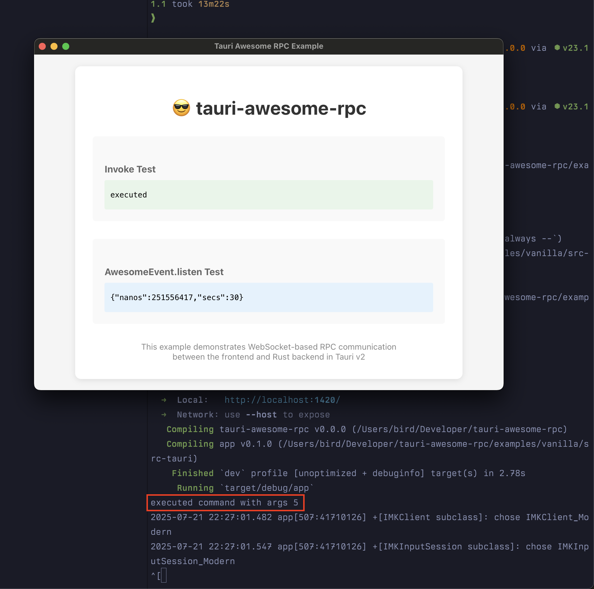
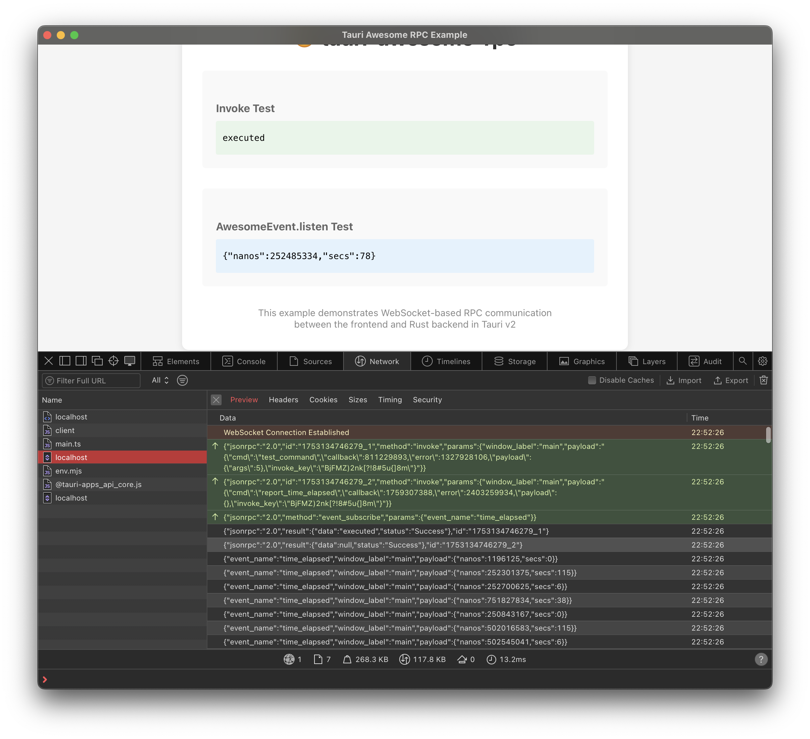

# Tauri Awesome RPC Example

This example demonstrates how to use `tauri-awesome-rpc` with Tauri v2.




## Features

- WebSocket-based JSON-RPC communication
- Custom invoke system
- Event emission from Rust to frontend
- Real-time updates using `AwesomeEvent`

## Running the Example

1. Install dependencies:
   ```bash
   pnpm install
   ```

2. Run in development mode:
   ```bash
   pnpm tauri dev
   ```

3. Build for production:
   ```bash
   pnpm tauri build
   ```

## How it Works

This example showcases two main features:

1. **Custom Invoke System**: The `test_command` is invoked through the WebSocket-based RPC system instead of Tauri's default IPC.

2. **Event System**: The `report_time_elapsed` command starts a background task that emits time updates every 250ms, which are received on the frontend using `window.AwesomeEvent.listen()`.

